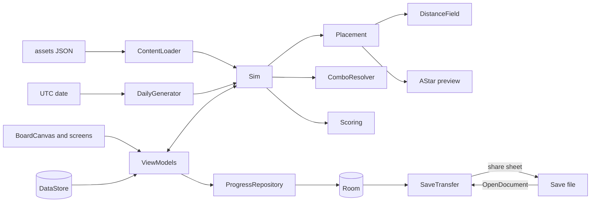

# Snarewall: your walls decide the path

Raiders file toward your keep. You drop one stone block and the orange route thread bends around it: four steps longer. Snarewall is a maze tower defense where the maze is the game: open floor, walls that reroute enemies live, traps that chain. Fifteen handmade levels, a daily map, one price, no ads, no network.

## 1. Overview

- **Elevator pitch:** build the enemy's path with free-form walls, watch a live route preview redraw on every placement, and chain ten traps into four visible combos against twelve enemies that punish lazy mazes.
- **Play category:** Games, Strategy. **Launcher name:** Snarewall. **Play title:** Maze Tower Defense Offline.
- **Tagline:** Your walls decide the path.
- **Positioning line:** "The maze is yours: a no-ads, no-IAP tower defense where your walls decide the enemy path, priced under the big paid brands."
- **Price:** USD 2.99, INR 149, one-time.
- **Name:** Deadfall collides with two Play apps and two shooters; "snarewall" returned no Play results and no trademark hits (refuter, 2026-09-13 and 09-17). USPTO and IP India checks run before listing.

## 2. Problem and why now

The buyer is tired of fixed roads and of free games that stop for an ad or a gem offer. Paid "tower defense offline" in the US is brand territory: Kingdom Rush Vengeance $4.99 (4.7), Kingdom Rush Frontiers $1.99 (4.8, about 2.3M installs, https://play.google.com/store/apps/details?id=com.ironhidegames.android.kingdomrushfrontiers), Bloons TD 6 $6.99 (5M+, https://play.google.com/store/apps/details?id=com.ninjakiwi.bloonstd6), Isle of Arrows $5.99 (4.0, https://play.google.com/store/apps/details?id=com.gridpop.isleofarrowsandroid). All run enemies down paths the designer drew.

**The free incumbents, answered.** Infinitode 2 (free, 4M+, 4.7 from about 108K reviews, https://play.google.com/store/apps/details?id=com.prineside.tdi2) is what a buyer tries first, and it is good: a grid tower builder with in-app purchases. Kingdom Rush (free, 4.7) uses fixed paths and sells heroes; Mini TD 2 (free, 4.8) ranks beside them on "tower defense no ads". A buyer pays $2.99 anyway for four reasons, all in 1.0:

1. **The maze is player-built on every level,** with a live A* route preview that redraws while the wall is still a ghost under the finger. No free leader does this, and Mazebert TD ($5.99) plays cards on a fixed maze.
2. **Traps combine visibly:** pusher into deadfall, oil into ember, frost into shatter hammer, snare net onto spike plate, each drawing a link mark when placed to work.
3. **Enemies attack the maze:** diggers tunnel under a long detour, jumpers hop thin walls, sappers break one, flyers ignore walls.
4. **Nothing to buy and nothing online:** no premium currency, energy, ads or INTERNET permission, stated in the short description.

**Evidence.** Dungeon Warfare 2, the solo maze-trap anchor, still moves: $4.99, about 133.8K estimated installs, 4.87 from 2,593 ratings, about 27 new ratings in 30 days, updated Sep 13 2026 (https://www.androidrank.org/application/x/valsar.dungeonwarfare2). That is brand and Play Pass velocity; Snarewall does not plan on it. The open phrase is "maze tower defense": all-price US results show one free app with 100+ downloads, and the paid filter shows no free-form wall builder (https://play.google.com/store/search?q=maze%20tower%20defense&c=apps&price=2). Demand is inferred from result depth and autocomplete, not keyword volume. **Why now:** March 2026 brought Game Trials and wishlist discount alerts for paid games (https://android-developers.googleblog.com/2026/03/building-a-bigger-stage.html). Honest outlook: tens to low hundreds of paid installs a month.

## 3. Target audience and personas

- **Tomasz Wróbel, 34, logistics planner, Kraków.** Finished every maze TD he found. Types **"maze tower defense"**. Pays when screenshot 1 shows a wall ghost bending the route with "+6 steps" at the keep.
- **Ananya Rao, 27, QA engineer, Bengaluru.** Plays on the metro where signal drops; hates interstitials. Types **"tower defense no ads"**. Pays INR 149 when the short description says "no ads, no IAP, no account, offline".
- **Gareth Pryce, 41, school technician, Swansea.** Plays on a tablet and wants no gem shop near his kids. Types **"tower defense no in app purchases"**. Pays after the tablet screenshot and the line "Every trap, enemy, level and difficulty is in the game from the first launch."

## 4. Core concept deep-dive

**How a level plays.** An 8 by 12 tile board, fixed so tiles stay 44dp or larger on a phone with no panning: one or two gates on top, a keep at the bottom, a few obstacles per region. Start with coin and 20 hearts. Walls cost 1 coin, traps 4 to 12. Build between waves or during them; pause any time; 1x, 2x or 3x speed. Kills pay coin, leaks cost hearts. Score is kills plus hearts plus unspent coin; any clear is bronze, and two hand-set par scores give silver and gold.

**The one memorable thing: the route thread.** A 3dp dashed Route-coloured line runs from each gate to the keep along the shortest path, with a step chip at the keep. While a wall ghost is dragged, the thread recomputes on every tile it enters: "+6 steps", new route drawn, old one fading. A ghost that would seal every path shows a cross glyph, keeps the old thread and the chip reads "Seals the keep".

**Pathing.** Ground enemies follow a distance field (breadth-first from the keep) recomputed on each committed placement, so enemies mid-maze reroute next tick. The preview is A* from each gate on the same grid; a test proves both lengths agree. A placement is legal only if every gate still reaches the keep and no enemy stands on the tile.

**Traps.** Floor: spike plate, oil slick, ember grate, frost vent, snare net. Wall-mounted, acting on the floor tile they face: pusher, deadfall, dart wall (hits its row, flyers included), shatter hammer, grinder. One upgrade each; a second tier waits for 1.x to halve the balancing surface.

**Enemies.** Raider, runner, brute (armoured), shieldbearer (darts blocked from the front), swarmling (packs), digger (tunnels once under the first wall on its line when the route is much longer than open floor), jumper (hops a single-thickness wall on cooldown), flyer, oilskin (fireproof), frostborn (unslowable), sapper (destroys the first wall it touches), and a warlord closing each region.

**Game Trial.** Decided: 1.0 has no trial code and is complete on install. Google says Game Trials are time-limited, added to the App Bundle by Play, "in testing with select titles", with an in-game-event end point promised later (https://android-developers.googleblog.com/2026/03/building-a-bigger-stage.html), so a "first 4 levels" trial needs gating code the batch forbids. If Play opens trials to this account, opt in with Play's time limit; progress carries over because the binary is the same.

**What it refuses.** Premium currency, energy, loot boxes, anything gambling-shaped, leaderboards, accounts, cloud saves, blood, mascots, Play Pass dependency.

## 5. Complete feature set

**v1.0:**
1. Free-form walls on every level with the live A* route preview, step delta and seal warning.
2. 15 handmade levels in 3 regions (Chalk Downs, Salt Mine, Fen Causeway), 6 to 12 waves each, a warlord finale per region.
3. 3 difficulties (Warden, Standard, Iron) with bronze, silver and gold par medals per difficulty.
4. 10 traps with 1 upgrade each and 4 combos shown by a link mark.
5. 12 enemy types including diggers, jumpers, flyers and sappers.
6. Daily endless map generated from the UTC date (board, obstacles, six-trap roster, waves), same for every player, with local best per day and history.
7. Share a daily result as a text line through the share sheet.
8. 1x, 2x, 3x speed; pause and build; undo every placement in the current wave with full refund.
9. Level 1 is the tutorial, three coach marks, playable within a minute of first launch.
10. Briefing sheet before each level naming new enemies with a one-line counter-trait note ("Digger: tunnels under your first wall").
11. CC0 sound effects with volume; haptic tick on placement and combo.
12. Resume: the state is saved at every wave boundary, so a kill mid-wave relaunches at the start of that wave.
13. Save file export through the share sheet, import through the system picker.
14. Two-pane tablet and unfolded-foldable layout; light and dark themes.

**Cut, per the refuter:** 40 levels and 5 regions; 18 traps and 22 enemies; keyboard hotkeys and Chromebook window work; a SAF backup-folder feature (the share-sheet save file stays because the batch contract requires export); any Play Pass plan; a level-bounded Game Trial (see section 4). Cut for a solo six weeks: the Almanac and a second upgrade tier. Music is cut from 1.0 for schedule. Nothing is cut for offline honesty.

**v1.x:** Almanac of traps, enemies and combos; a second upgrade tier per trap; a fourth region of 5 levels; a music loop per region; the level-4 Game Trial end point once Play ships in-game-event control; alternate route patterns for colour vision. **v2:** level editor with levels shared as text codes; hardware keyboard hotkeys.

## 6. Screen-by-screen UX

**Navigation.** One `NavHost`, no bottom bar; Home is the hub. Back on the Board opens the pause sheet.

- **Home:** Bungee wordmark, "Continue level 7" (first launch: "Play level 1"), then rows for Levels, Daily map, Settings.
- **Levels:** difficulty control, three region sections of five tiles with medals; a locked tile reads "Clear level 6 first".
- **Briefing sheet:** waves, new enemies with counter-trait notes, par scores, "Start level".
- **Board:** HUD (hearts, coin, "Wave 4 of 9", speed, pause), the board, tray (Wall, then this level's traps with cost). Tapping a placed item opens upgrade and sell. "Send wave" starts the next wave.
- **Pause sheet:** Resume, Undo last placement, Restart level, Quit to home.
- **Result:** cleared or fallen, score against par, medal, "Next level" or "Try again".
- **Daily map:** today's board and roster, "Play today's map", best today, history.
- **Settings:** theme, haptics, sound volume, left-handed tray, step chip, Export save, Import save, Licences, Privacy policy.

**Flow 1, first minute.** App opens on level 1; the thread draws gate to keep once; "Place a wall. Watch the route bend."; drag a ghost, chip shows "+4 steps", lift to commit; "Put a spike plate on the route."; "Send the first wave."

**Flow 2, combo under pressure.** Level 8, wave 6, a jumper hops a thin wall; pause; thicken to two tiles, chip steady; pusher on the corner facing a tile, deadfall on it, link mark appears with a haptic tick; resume at 2x, a brute is shoved onto the deadfall.

**Flow 3, daily.** Home; Daily map; Play today's map; keep falls on wave 23; "New best for today"; Share result.

## 7. Design system

**Design read:** Reading this as: a maze-building strategy game for adults who plan before they fight, with a chalk-quarry masonry language (cut stone blocks, a surveyor's thread, a warden's tally), leaning toward Bungee plus Lexend on a limestone and snare emerald palette.

**Palette family: limestone and snare emerald.** Quarry floor, mossy walls, a surveyor's orange thread.

**Dials.** Variance 4: a strict grid; the only asymmetry is the player's maze. Motion 4: motion answers placement and combat, never idles. Density 6: the board is busy, so chrome stays thin.

| Token | Role | Light | Dark |
|---|---|---|---|
| Limestone | background, HUD, tray | #E3E7E1 | #141C19 |
| Flag | board floor, sheets, tiles | #F3F5F1 | #1E2824 |
| Ink | text, icons, obstacle and enemy sprites | #17211D | #E2E8E4 |
| Lichen | secondary text, locked tiles, grid seams | #4D5B54 | #9DAAA3 |
| Emerald | the one accent: walls, primary buttons, valid ghost, combo link | #1A7550 | #4DBE8B |
| Route | route thread, step chip, seal warning, errors | #A63F14 | #E68E5A |

Emerald (64 and 47 percent saturation) is identical on every screen; Route (79 and 74) marks only the thread and warnings. Computed contrast, light then dark: Ink on Limestone 13.2 and 14.0:1; Lichen on Limestone 5.7 and 7.2:1; Emerald on Limestone 4.5 and 7.5:1; Route on Flag 5.7 and 6.1:1; button labels Flag on Emerald 5.2:1 and Limestone on Emerald 7.5:1. Emerald and Route share luminance, so colour never carries meaning alone: walls are filled blocks, the route is dashed, an invalid ghost adds a cross and words. Board-only tokens in `Color.kt`: `RegionTintChalk`, `RegionTintSalt`, `RegionTintFen`, 8 percent overlays on Flag.

**Type.** **Bungee** Regular 400 (Google Fonts), a blocky signage face like cut stone, for wordmark, level titles, HUD numbers and the step chip only. **Lexend** 400, 500, 600 (Google Fonts) for all UI and reading. Both SIL Open Font License 1.1, copied to `docs/OFL-Bungee.txt` and `docs/OFL-Lexend.txt`. No serif. Scale: level title 28sp, screen title 22sp, HUD 18sp, body 16sp at 1.5 line height and a 60-character measure, labels 14sp, chip 13sp.

**Radius.** RadiusSm 2dp (tiles, walls, chips), RadiusMd 8dp (buttons, tray slots), RadiusLg 16dp (sheet tops).

**Icons.** Material Icons Rounded (`Icons.Rounded`) via `material-icons-extended` for chrome (Pause, PlayArrow, FastForward, Undo, Settings, Share, ArrowBack, Close). Traps and enemies are sprites.

**Art direction.** 16px Kenney 1-Bit Pack sprites (CC0, https://kenney.nl/assets/1-bit-pack) scaled by whole multiples, tinted Ink (obstacles, enemies), Emerald (walls, traps) and Route (projectiles); missing trap frames drawn on the same grid. Armoured, hooded silhouettes, no blood: a hit flashes the sprite.

**Motion.** One first-run moment: the thread draws gate to keep over 700 ms, once per install. Otherwise the thread redraws in 150 ms, a committed wall settles from 0.9 scale in 90 ms, a combo link flashes once, sheets slide 200 ms. No idle loops or shimmer. Under `LocalReducedMotion` all UI motion snaps and the first-run draw is skipped; the simulation still runs because it is the game.

**States.** Loading anywhere over 300 ms is a skeleton of the content.
- Home: empty "Play level 1"; error "Your progress could not be read. Import a save file or start fresh." with both buttons; success "Continue level 7".
- Levels and Briefing: never empty; error "Levels could not be read." with "Back to home".
- Board: empty is the opening board with "Send wave"; inline errors "Seals the keep" and "Needs 8 coin"; load error "This level's save could not be read." with "Restart level"; success "Upgraded pusher"; Pause undo with nothing shows "Nothing placed this wave".
- Result: "Cleared level 9" or "The keep fell on wave 6." with "Try again".
- Daily: empty history "Your daily scores collect here." with "Play today's map"; error "Today's map could not be built." with "Try again"; success "New best for today".
- Settings: "Save exported", "Save imported" after "Importing replaces your progress."; errors "That file is not a Snarewall save." and "That save is from a newer version of Snarewall."

**Access.** Tiles 44dp+, buttons 48dp, `contentDescription` on icon buttons; the canvas exposes one node reading "Wave 4 of 9, 16 hearts, 23 coin, route 31 steps". Text scales without clipping.

**Large screens.** Portrait on phones. Android 16 ignores the lock at sw600dp, so at 600dp width `WindowSizeClass` switches to two panes: board left at the largest whole tile size, HUD and tray in a 320dp rail. State lives in `BoardViewModel` across rotation.

**Screenshots (9:16).** 1 Light, Salt Mine: wall ghost bending the thread, "+6 steps". 2 Pusher and deadfall link mid-shove. 3 Digger and jumper breaking a thin maze. 4 Daily map with history. 5 Dark, Fen Causeway at 3x, oil burning. 6 Dark tablet two-pane.

**Icon (per `ICON.md`).** Emerald, hue 147, as in the registry. Ground #22B865 (69 percent saturation, 43 percent lightness) to #1CA85C (71 and 38). Mark: a two-course cut-stone wall in running bond, near-white stones with deep green #0B4A28 mortar edges (7.9:1 stone to mortar, 4.0:1 mortar to ground), and an Ink #17211D dashed route thread (6.4 and 5.4:1 on the two stops) that runs along the wall top, hairpins around its end and closes in a snare loop beneath it. Monochrome layer: the same shapes flat.

## 8. Native architecture

```
new-native-app.sh --name "Snarewall" --pkg com.mohdshayan.snarewall --perms "" --room --bg "#E3E7E1" --bg-dark "#141C19" --orient portrait
```

**Modules.** `:app` only; `game/` is plain Kotlin with no Android imports, tested in `app/src/test`.

**Package map** (`com.mohdshayan.snarewall`): `game/` (`Grid`, `Placement` (legality, costs, undo), `AStar`, `DistanceField`, `Sim` at 60 ticks per second, `EnemyKind`, `TrapKind`, `ComboResolver`, `WaveScript`, `Economy`, `Scoring`, `Rng` (SplitMix64), `DailyGenerator`, `GameState`, `SaveCodec`); `content/ContentLoader`; `data/db/`; `data/prefs/AppPrefs`; `data/ProgressRepository`; `data/SaveTransfer`; `audio/Sfx` (`SoundPool`); `ui/home`, `ui/levels`, `ui/briefing`, `ui/board` (`BoardCanvas`, `BoardViewModel`, `HudStrip`, `TrapTray`, `PauseSheet`, `CoachMark`), `ui/result`, `ui/daily`, `ui/settings`. ViewModels are `AndroidViewModel` with `stateIn(WhileSubscribed(5_000))`.

**Game loop.** `BoardCanvas` runs `withFrameNanos` in a `LaunchedEffect`, accumulates elapsed time times speed and calls `Sim.step()` in fixed increments, capped at 8 per frame. It draws an immutable snapshot, enemies interpolated between ticks, from one sprite atlas `ImageBitmap`. Distance field and A* run only on placement or ghost moves over 96 tiles.

**Catalog aliases:** `androidx-core-ktx`, `androidx-core-splashscreen`, `androidx-lifecycle-runtime-ktx`, `androidx-lifecycle-runtime-compose`, `androidx-lifecycle-viewmodel-compose`, `androidx-activity-compose`, `androidx-compose-bom`, `androidx-ui`, `androidx-ui-graphics`, `androidx-ui-tooling`, `androidx-ui-tooling-preview`, `androidx-material3`, `androidx-material-icons-extended`, `androidx-navigation-compose`, `androidx-room-runtime`, `androidx-room-ktx`, `androidx-room-compiler`, `androidx-datastore-preferences`, `kotlinx-coroutines-android`, `kotlinx-coroutines-test`, `kotlinx-serialization-json`, `junit`; plugins `android-application`, `kotlin-android`, `kotlin-compose`, `kotlin-serialization`, `ksp`. Added: `androidx-material3-window-size-class` (BOM-managed) and `google-play-review-ktx` (`com.google.android.play:review-ktx:2.0.2`, merges no permission; the Play Store app does the network work).

**Hardware.** None. Haptics use `LocalHapticFeedback`, which needs no permission.

**Bundled assets.** `assets/levels/` (15 JSON) and `assets/tables/` (traps, enemies, combos, daily waves), under 200 KB. One sprite atlas PNG under 300 KB from the Kenney 1-Bit Pack (CC0). About 20 OGG effects from Kenney Impact Sounds and Interface Sounds (CC0, https://kenney.nl/assets/impact-sounds, https://kenney.nl/assets/interface-sounds), under 1 MB. Bungee and Lexend TTFs under 1 MB, OFL 1.1. All licence texts in `docs/` and listed in Settings.

**Permissions.** None declared, hence `--perms ""`. Room, DataStore, review-ktx and `FileProvider` (authority `${applicationId}.files`, path `exports/`) merge none; `VIBRATE` is not needed; `INTERNET` is absent and `verify.sh` confirms it.

**Background work.** None: no WorkManager, alarms, services, notifications, widgets or tiles. The daily map is computed from the date when opened.



## 9. Data model

**Room entities** (version 1):
- `LevelProgressEntity`: `levelId: Int` plus `difficulty: String` composite PK, `bestScore: Int`, `medal: String` (none, bronze, silver, gold), `bestHearts: Int`, `clears: Int`, `firstClearedAt: Long?`, `lastPlayedAt: Long`.
- `ResumeEntity`: `slot: Int` PK (always 0), `levelId: Int`, `difficulty: String`, `waveIndex: Int`, `stateJson: String`, `savedAt: Long`.
- `DailyScoreEntity`: `dateKey: String` PK (yyyy-MM-dd UTC), `bestWave: Int`, `bestScore: Int`, `runs: Int`, `lastPlayedAt: Long`.

**GameState JSON** (wave boundary, so no live enemies): `levelId`, `difficulty`, `wave`, `hearts`, `coin`, `walls: List<Int>`, `traps` (`tile`, `kind`, `facing`, `upgrade`), `scoreSoFar`, `rngState`.

**DataStore keys:** `theme`, `haptics`, `sfx_volume`, `left_handed_tray`, `show_step_chip`, `last_difficulty`, `default_speed`, `tutorial_done`, `first_route_drawn`, `levels_cleared_total`, `review_prompted`.

**Export and import.** `snarewall-save-<yyyyMMdd>.json`: `{ "format": "snarewall-save", "formatVersion": 1, "exportedAt", "levelProgress", "resume", "dailyScores", "settings" }`. Export sends `ACTION_SEND` with a `FileProvider` URI. Import reads an `OpenDocument` URI, checks `format`, rejects a newer version, confirms, and replaces all tables in one transaction.

## 10. Pricing and countries

**USD 2.99, INR 149**, Paid set before the first release. Rung: premium game original ($2.99 / Rs 149), the refuter's choice over the idea's $3.99. All paid-app countries; India and other lower-income markets set by hand, because auto-converted USD prices land 2 to 3 times above what buyers there pay (pricepush.app and regionalpricecalculator pricing guides, 2026). **Launch:** list price, then a 20 percent sale in week two for the strikethrough badge; never a $0 sale. **Refunds:** Play's window applies; level 1 plays within a minute. **Why this price:** mobile-native paid originals sell at $0.99 to $3.99 (Reigns, Golf Peaks $2.99); $2.99 sits under Kingdom Rush Vengeance and Isle of Arrows, above $0.99 clones.

## 11. Play Store listing

**Title (26 characters):** Maze Tower Defense Offline

**Short description (80 characters):** Build mazes, chain traps. One-time purchase: no ads, no IAP, no account, offline

**Full description (1,614 characters):**

```
Snarewall is a maze tower defense where your walls decide the enemy path. Every level is open floor: place a wall and the route line redraws at once, so you see the new path before the first raider arrives.
Chain your traps. A pusher shoves raiders onto a deadfall. Oil spreads the fire from an ember grate. Frost sets up the shatter hammer. Linked traps show a mark between them, so you know a combo is live.
One-time purchase. No ads, no subscription, no account. Works fully offline.

What you get
- 15 handmade levels across 3 regions: Chalk Downs, Salt Mine and Fen Causeway
- 3 difficulties on every level, with a par score and bronze, silver and gold medals
- 10 traps and 4 visible combos
- 12 enemy types that break lazy mazes: diggers tunnel under a wall, jumpers hop a thin one, flyers ignore walls, sappers knock one down
- A daily endless map built from the date, so everyone playing today gets the same layout, with your best score kept for every day
- 2x and 3x speed, pause and build, and undo for every placement in the current wave
- Export your save file through the share sheet and import it from any file

Nothing else to buy
There are no in-app purchases, no premium currency, no energy timers and no ads. Every trap, enemy, level and difficulty is in the game from the first launch. There is no login and no network access: the app does not request internet permission, so nothing about your play leaves your phone.

Room on a tablet
On a tablet or unfolded phone the board sits beside the trap tray, so the maze gets the room.

Snarewall is a strategy game with fantasy combat and no blood.
```

**Keywords:** maze tower defense, tower defense offline (title only), tower defense no ads, no in-app purchases, trap, maze builder, strategy, daily map, offline game. Never Dungeon Warfare, Kingdom Rush, Bloons or any trademark in metadata.

**Screenshot captions:** 1 "Every wall redraws the enemy path". 2 "Shove them onto the deadfall". 3 "Diggers and jumpers break lazy mazes". 4 "A new daily map for everyone". 5 "Oil, ember, fire: traps that chain". 6 "No ads. No in-app purchases. Offline."

**Feature graphic:** emerald gradient ground, the mark large at left, "Snarewall" in Bungee, "Build the maze. Chain the traps." in Lexend.

**Category:** Games, Strategy. **Content rating:** IARC, fantasy violence, no blood, no gambling, no user interaction, no purchases; expected Everyone 10+. **Target age:** 13 and over. **Plainly:** paid, no ads, no in-app purchases, works offline.

## 12. Policy and data safety

- **Data safety:** nothing collected, shared or transmitted; saves leave the device only when the user sends a save file.
- **Ads, in-app purchases, account, permissions:** none, so no deletion flow and no sensitive forms; health and financial declarations do not apply; target 13 and over with no kids-appealing art.
- **Privacy policy:** `docs/privacy-policy.html`, generated from the empty permission list, hosted before Data safety, linked in Settings.
- **Never claim:** online leaderboards or global daily rankings, cloud save, 40 levels, "free", "best", Play Pass, competitor names, or content not in the binary.

## 13. Organic growth

The title carries "maze tower defense", the winnable phrase, and "tower defense offline", where brands rank and copy does not chase it. The short description matches "tower defense no ads" and "no in app purchases". The description's first lines carry maze, walls, route and traps. Screenshot 1 shows a maze being built. **Review prompt:** `review-ktx` once on Result after the third level clear, never on first launch or after a loss. **Launch:** a short clip on r/TowerDefense. **Not done:** paid UA, incentivised reviews, competitor keywords, a free twin.

## 14. KPIs

No telemetry. Two local counts (levels cleared, daily runs) stay in DataStore and only time the review prompt. The three numbers come from Play Console, read weekly:
1. **Paid installs:** tens in month one, toward low hundreds by month three. Below that, rework screenshot 1 and the short description.
2. **Refund rate:** under 10 percent. Above it, the first minute is failing: shorten the level 1 coach marks.
3. **Rating:** 4.5 or better once 30 ratings exist, without recurring path-bug complaints.

## 15. Risks and mitigations

1. **Refund window:** first launch lands on level 1 with the wall tool ready; the first combo is on level 3; screenshots show exactly this game.
2. **Infinitode 2, free and excellent:** lead with what it lacks (player-built walls, live route, trap chains, no IAP) and target the maze phrase, where brands do not sit.
3. **Hardest subsystem, the fixed-step sim with live rerouting:** enemies keep their current tile until the next step, occupied tiles refuse walls, seeded RNG and fixed step let a JVM test replay a level at 1x and 3x to the same result; low-end emulator check at 3x in week 5.
4. **Balancing 45 level and difficulty pairs:** waves, pars and multipliers are JSON, tested for solvability, with two playthroughs per difficulty.
5. **Art reads kids-appealing or cheap:** tinted 1-bit sprites, no mascots, licences in `docs/`.
6. **Name conflict:** trademark searches first; fallback name Mazewright.

## 16. Competitive landscape

- **Infinitode 2:** free with IAP, 4M+, 4.7, active. Snarewall: wall mazes, live route, trap chains, no store.
- **Kingdom Rush:** free with IAP, 10M+ estimated, 4.7. Fixed paths; Snarewall's paths are the player's.
- **Kingdom Rush Frontiers and Vengeance:** $1.99 and $4.99, 1M+ each, 4.8 and 4.7, fixed paths; Snarewall builds the path.
- **Bloons TD 6:** $6.99, 5M+, 4.8, active, DLC and IAP. Snarewall has nothing to buy after the price.
- **Dungeon Warfare 2:** $4.99, about 133.8K, 4.87, updated Sep 13 2026. Snarewall adds a live route preview, visible combos, a daily map.
- **Isle of Arrows:** $5.99, 100K+, 4.0. Half the price, free-form walls.
- **Mazebert TD:** $5.99, 5.0, new. Cards on a fixed maze; Snarewall builds the maze.

## 17. Development plan

- **Week 1:** generate, `make-key.sh snarewall`, fonts and tokens; `Grid`, `Placement`, `AStar`, `DistanceField`, `Rng`, `Sim` with raiders, tests green; `BoardCanvas` with walls, ghost and thread.
- **Week 2:** all enemies and traps, `ComboResolver`, `Economy`, `WaveScript`; HUD, tray, speed, pause, undo; sprite atlas; levels 1 to 3 with coach marks.
- **Week 3:** levels 1 to 10; Levels, Briefing, Result, Home; `Scoring` with medals and difficulties; Room progress and resume.
- **Week 4:** levels 11 to 15 and warlords; `DailyGenerator`, Daily screen, history, share; SFX.
- **Week 5:** Settings, `SaveTransfer`, all states, dark mode, two-pane layout, TalkBack node; balance playthroughs; 3x performance pass.
- **Week 6:** review prompt, icon and feature graphic, screenshots, listing, privacy policy, README, preflight, buffer.

**Total: 6 weeks.**

**If behind, cut in order:** volume slider (on and off only), briefing counter-trait notes, daily share line, first-run thread draw, left-handed tray. Never cut the refuter's must-haves.

**JVM tests:** `AStarTest` (agrees with `DistanceField`); `PlacementTest` (seal, occupied, undo); `RerouteTest`; `ComboResolverTest`; `EnemyTraitTest`; `ScoringTest`; `DailyGeneratorTest` (same date same map, 1,000 dates solvable); `SimDeterminismTest` (1x equals 3x); `LevelSolvabilityTest`; `ContentIntegrityTest` (ids resolve, no U+2014 or U+2013); `SaveCodecTest` (round trip, bad or newer file rejected).

**Emulator smoke:** airplane mode; a wall bends the thread on level 1; kill mid-level 2, relaunch to that wave's start; trigger pusher into deadfall; play the daily and see history; rotate on a tablet profile; dark mode on every screen; export, clear data, import, medals return.

**Preflight:** `build.sh snarewall` prints `CN=SocialSure Private Limited`, tests green; `verify.sh snarewall` no FAIL; `smoke.sh snarewall com.mohdshayan.snarewall` passes and PNGs viewed; no merged permissions; OFL and CC0 licences in `docs/`; policy hosted; Paid set before release; release notes under 500 characters; testing tracks paused after release.
